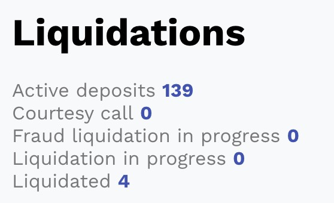
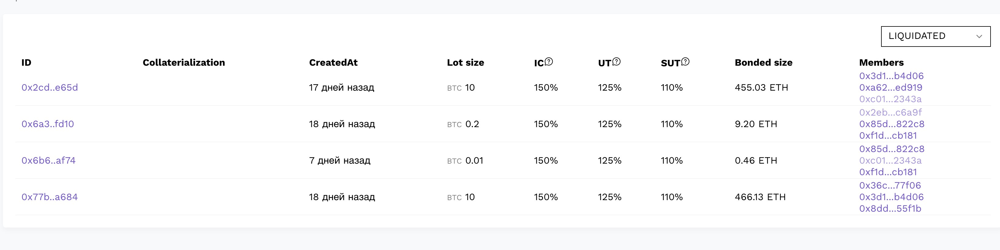
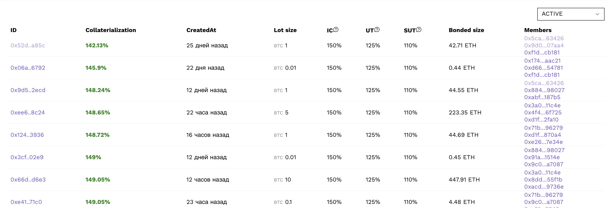

[Russian description](README.ru-RU.md)

Our resource is a fork of the site [allthekeeps.com](allthekeeps.com) with one difference: a Liquidations section has been added for a more convenient orientation in deposits that have already been liquidated / are in the process of liquidation / may soon be liquidated. 

### Main functions:
  - Convenient view of the number of deposits with statuses: Active deposits, Courtesy call, Fraud liquidation in progress, Liquidation in progress, Liquidated;

  - viewing all deposits with a certain status;

  - sorting of deposits by % Collaterialization to determine the most risky positions;

